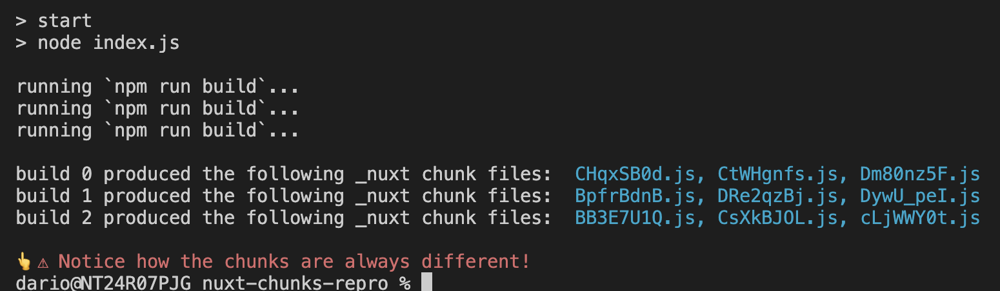

# Nuxt 3 _nuxt chunks hashing repro

This shows how the chunk files produced by building a nuxt application (in this example targeting cloudflare pages) present different hashes every time.

> [!NOTE]
> This project has been created by running `npx nuxi@latest init nuxt-chunks-repro` and setting the `cloudflare-pages` preset, without any other modification (besides the start script mentioned below 👇).

To run the reproduction simply install the dependencies:
```
npm i
```
and run the start script:
```
npm start
```

It should present the following result, showcasing that `nuxt build` generates different `./dist/_nuxt/xxx.js` files for the exact same application:

